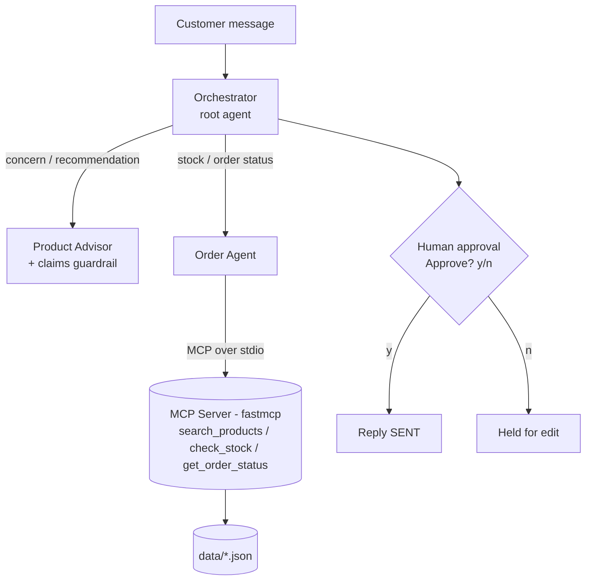

# FatiBot — Multi-Agent Customer-Service Assistant for Fatima's Garden

A Kaggle capstone prototype (Google × Kaggle **5-Day AI Agents**). **FatiBot** is a small
**multi-agent** system that helps customers of the organic-cosmetics brand **Fatima's Garden**:
it recommends products for a skin/hair concern, checks live stock and order status through a
**custom MCP server**, drafts a reply, and **pauses for human approval** — with a
**cosmetics-compliance guardrail** that strips any forbidden medical claims.

> **FatiBot** is the whole system; its root agent is the **Orchestrator**, which delegates to two specialists.
> Product and order data is **sample data** (no real customer data). Built on **Google ADK + Gemini**.

## The problem & why agents
A support reply here needs several different skills — understanding a concern, knowing the
catalog, querying live stock/orders, and staying legally compliant. A single prompt would mix
these and hallucinate stock. Splitting the work across a **coordinator + specialists**, giving
the data agent **real tools** (via MCP) instead of guesses, and adding a **human gate** before
sending is exactly what an agentic design buys you: grounded answers and safe actions.

## Architecture


## Concepts demonstrated (Kaggle requires ≥ 3)
| # | Concept | Where in the code |
|---|---|---|
| 1 | **Multi-agent system (ADK)** | `agents/coordinator.py` — the **Orchestrator** with `sub_agents=[product_advisor, order_agent]` |
| 2 | **Custom MCP server** | `mcp_server/server.py` (fastmcp/stdio) ↔ `agents/order_agent.py` (`McpToolset`) |
| 3 | **Security: guardrail + HITL** | `guardrails/claims_filter.py` (+ `after_model_callback`) and the approval gate in `main.py` |

The 4th concept, **Antigravity** (the IDE), is shown in the video only — it is not code.

## Setup (Windows / PowerShell)
Prerequisite: **Python 3.11+** (this project was scaffolded with 3.12).

```powershell
cd fatimas-garden-agent

# 1. Create and activate a virtual environment
python -m venv .venv
.\.venv\Scripts\Activate.ps1          # if blocked: Set-ExecutionPolicy -Scope Process RemoteSigned

# 2. Install dependencies
pip install -r requirements.txt

# 3. Configure your key (free Gemini key: https://aistudio.google.com/apikey)
copy .env.example .env
notepad .env                          # paste your GEMINI_API_KEY, save
```

## Run
```powershell
# A) Visual demo — multi-agent flow + MCP tool calls + Trace tab
adk web                               # then open the printed http://localhost:8000

# B) CLI demo — the Human-in-the-Loop approval gate
python main.py
python main.py "I have oily skin and want to know if ARGAN-30 is in stock"
```

`python main.py` prints a DRAFT reply, then asks `Approve and send this reply? [y/n]`. Only on
`y` is the final reply "sent" (printed). The guardrail softens any non-compliant phrasing first.

## Try these
- "I have **very dry skin** and damaged hair — what do you recommend?" → advisor suggests Argan/Shea;
  **Shea Butter is out of stock (0)**, so it offers an in-stock alternative.
- "Has my order **ORD-1043** shipped?" → Order Agent calls the MCP `get_order_status` tool → *processing*.
- The guardrail rewrites a phrase like *"cures eczema"* into compliant cosmetic language.

## Project layout
```
config.py        # loads .env, exposes MODEL + retry options (no secrets in code)
data/            # products.json, inventory.json, orders.json  (the fictional "world")
mcp_server/      # server.py — fastmcp tools over stdio
agents/          # coordinator + product_advisor + order_agent ; agent.py exposes root_agent
guardrails/      # claims_filter.py — pure check_claims() + ADK callback
main.py          # CLI HITL demo
```

## Notes
- **Models** (verified June 2026, set in `.env`): default `gemini-3.5-flash`; cheaper fallback
  `gemini-3.1-flash-lite`. `gemini-2.0-*` was shut down 2026-06-01.
- **Security:** the real key lives only in `.env` (git-ignored). Never commit it.
- Out of scope by design: observability, eval harnesses, CI/CD, deployment, A2A, payments.
